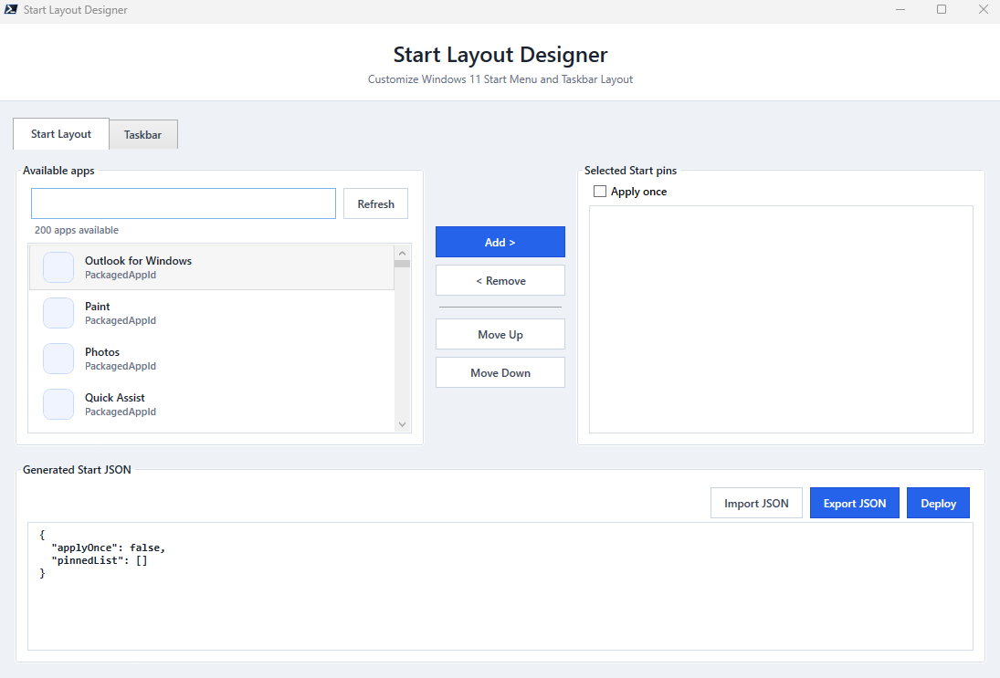

# StartLayoutDesigner

[](https://www.powershellgallery.com/packages/StartLayoutDesigner)
[](LICENSE)
[](https://docs.microsoft.com/en-us/powershell/)

**StartLayoutDesigner** is a PowerShell module with a WPF GUI for designing Windows 11 Start Menu and Taskbar layouts — and exporting them as policy-ready JSON and XML files.

---

## ⚠️ Disclaimer

> ⚠️ **Warning:** This module can write registry values and deploy layout files that affect the Start Menu and Taskbar for the current user or all users. It is provided *as-is* with no warranties or guarantees. Use at your own risk.
>
> Always review generated layout files before deploying them, especially in production or managed environments. The author is **not responsible** for any unintended changes to user profiles or group policy.

---

## Why I Built This

I spend a lot of time deploying and customizing Windows environments, and one thing that always annoyed me was creating Start Menu and Taskbar layouts.

Microsoft provides the tools and documentation to do it properly, but the process usually involves reading multiple documents, editing JSON and XML files by hand, testing deployments, finding mistakes, fixing them, and starting over.

It works, but it isn't particularly enjoyable.

I wanted a simple visual way to build layouts, see the result immediately, and export the files needed for deployment.

So I built StartLayoutDesigner.

The goal of this project isn't to replace Microsoft's deployment methods. It simply makes the layout creation process easier.

Whether you're deploying layouts through Intune, Group Policy, provisioning packages, or another management solution, this tool helps generate the required configuration files without manually writing them yourself.

### Microsoft Documentation

If you'd like to understand the underlying Windows configuration formats used by this tool, Microsoft provides official documentation:

- Start Menu Layouts:
  https://learn.microsoft.com/en-us/windows/configuration/start/layout

- Taskbar Pinned Apps:
  https://learn.microsoft.com/en-us/windows/configuration/taskbar/pinned-apps

## Screenshot




## What It Does

StartLayoutDesigner helps you create and deploy Windows 11 Start Menu and Taskbar layouts.

Features:

- Discover pinnable applications automatically
- Build Start Menu layout JSON files
- Build Taskbar layout XML files
- Design layouts through a WPF graphical interface
- Export deployment-ready configuration files
- Deploy layouts

## Installation

```powershell
Install-Module StartLayoutDesigner
```

## How to use

### Launch the GUI Designer

```powershell
Show-StartLayoutDesigner
```

The GUI has two tabs:

- **Start Layout** — select apps and export `StartLayout.json`
- **Taskbar** — select apps and export `TaskbarLayout.xml`

---

## Requirements

- Windows 11 23H2+
- PowerShell 7+
- .NET Framework 4.5+ (for WPF GUI)
- Must be run as Administrator for policy deployment

---

## Testing

Run unit tests with Pester:

```powershell
Invoke-Pester -Path tests
```

---

## License

Licensed under the MIT License
